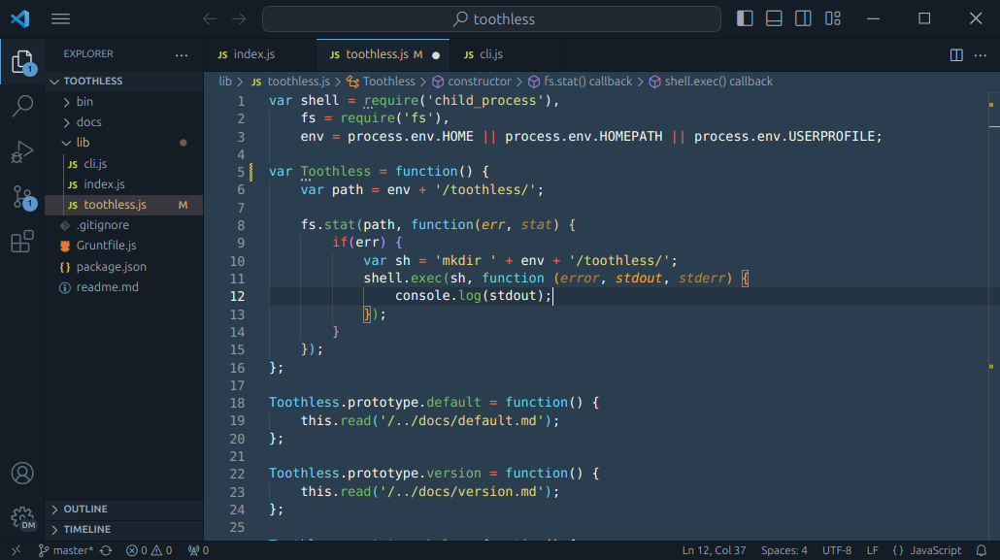

# Lucario VSCode Theme

VSCode port of [Raphael Amorim's Lucario theme](https://github.com/raphamorim/lucario). A darkish syntax theme for the 80% use case.



Selling points:

- a dark-ish theme that prevents eye strain while providing enough contrast for a well-lit room
- committed to provide good syntax highlighting for many languages, ~~not just Python and JavaScript~~
- inspired on [this beautiful creature](https://bulbapedia.bulbagarden.net/wiki/Lucario_(Pok%C3%A9mon)#firstHeading) :black_heart::blue_heart:

## Installation

Launch VS Code Quick Open (`Ctrl+P`), paste the following command, and press enter.

```txt
ext install victor-gp.lucario-theme
```

## Credit

The Lucario color scheme was [created by Raphael Amorim](https://github.com/raphamorim/lucario). It's available for a bunch of editors including Atom, Vim and Sublime Text.

The scripts to write a color theme in YAML (VSCode likes it JSON) are adapted from [the Dracula theme's](https://github.com/dracula/visual-studio-code).

Some of the code samples used for testing come from other projects. They are attributed in [this document](.samples/attribution.md).

The theme logo on the VSCode Marketplace is a Lucario sprite from Pokémon Café Mix.

## License

MIT © [Víctor González Prieto](https://github.com/victor-gp)
